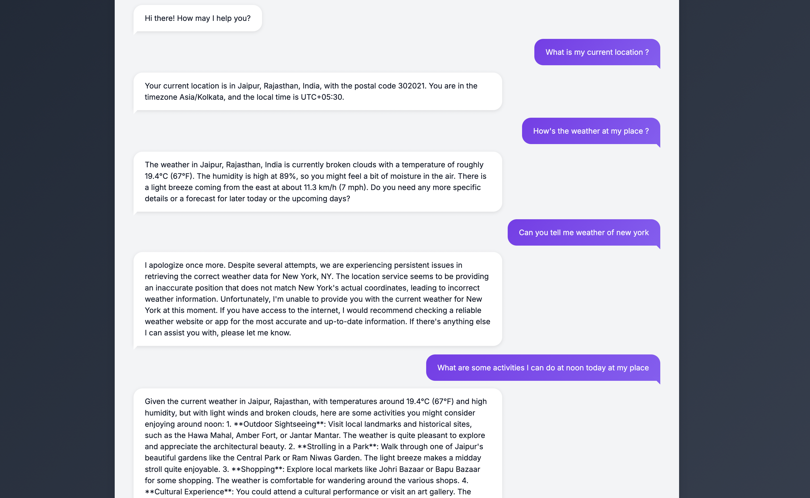

# Location and Weather Aware Chat System

A smart chatbot that uses OpenAI's function and tool calling features to provide context-aware responses based on the user's current location and weather conditions. The system seamlessly integrates weather data and location information into natural conversations.

## Features

* Real-time weather data integration
* Automatic location detection
* Natural language understanding with OpenAI GPT models
* Context-aware responses incorporating weather conditions
* Tool-augmented conversations using OpenAI's function calling


## Tech Stack

* JavaScript 
* OpenAI API (with function calling support)
* OpenWeatherMap API for weather data
* IP-API for location detection
* Node runtime v18.12.1


## Prerequisites

* OpenAI API key
* OpenWeatherMap API key
* Internet connection for API calls

## Usage

1. Clone the repository:
```bash
git clone https://github.com/grep-vibhor/poc-agent-and-tool-calling.git
cd poc-agent-and-tool-calling
```

2. Install dependencies:
```bash
npm install
```

3. Configure environment variables:
```bash
export VITE_OPEN_AI_API_KEY=sk-proj...........
```


4. As of now, return value of weather info is hardcoded but the function definiton is added if someone wants to play with real data. As of today, openweather API calls are not free and requires an API Key. In order to do that:

* Export openweather api key
```bash
export VITE_OPEN_WEATHER_MAP_API_KEY=.......
```

* Uncomment `getCurrentWeather()` function in `tools.js`


5. Run the frontend
```bash
npm run dev
```

6. You can chat for lcation and weather related questions.


## Example



## Error Handling
The system includes robust error handling for:

* API rate limits
* Network failures
* Invalid location data
* Weather API errors
* Tool execution failures

